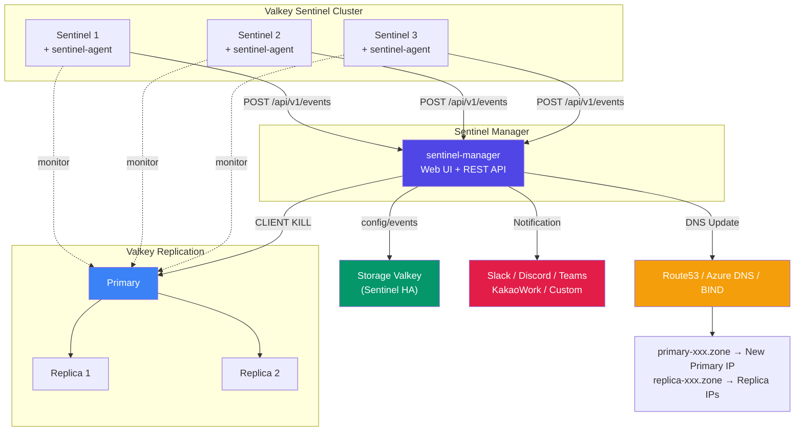
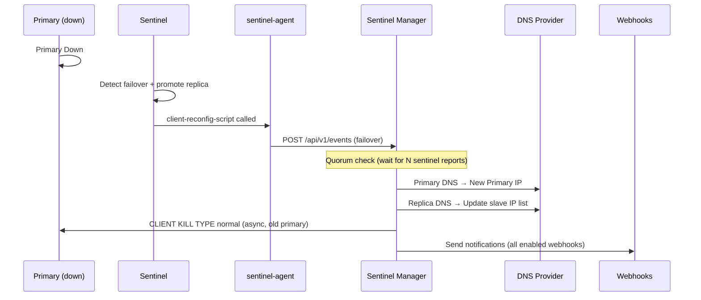
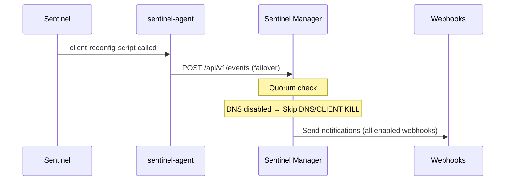
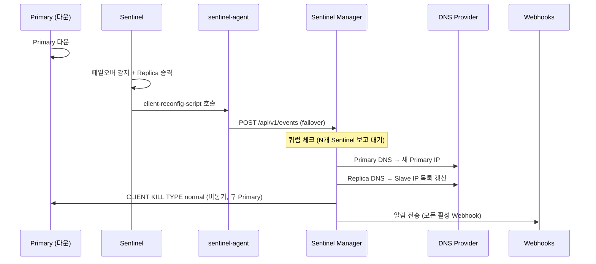

# Valkey Sentinel Manager

> [!TIP]
> **Just use Valkey Cluster mode.** It handles everything — automatic sharding, failover, rebalancing — no DNS, no Sentinel, no Manager needed. Problem solved.
>
> **그냥 Valkey Cluster 모드 쓰세요.** 자동 샤딩, 페일오버, 리밸런싱 다 해줍니다. DNS도 필요 없고, Sentinel도 필요 없고, 이 Manager도 필요 없습니다. 모든 게 해결됩니다.

**Web-based Valkey Sentinel Management & DNS Failover Automation**

Manage Valkey Sentinel clusters through a web UI — register/edit/delete replication groups, monitor sentinel nodes, automate DNS failover, and receive multi-channel notifications.

Valkey Sentinel 클러스터를 웹 UI로 통합 관리 — Replication Group 등록/수정/삭제, Sentinel 노드 모니터링, DNS 페일오버 자동화, 다채널 알림을 제공하는 시스템.

[English](#english) | [한국어](#한국어)

---

## Architecture



---

# English

A web-based management system for Valkey Sentinel that automatically updates DNS records on failover and provides a unified admin UI for monitoring and managing Sentinel clusters.

**Single Go binary** — all HTML/CSS/JS/fonts embedded. No extra file deployment needed.
Sentinel mode only. Cluster mode is not supported.

## Components

| Component | Description | Deploy To |
|-----------|-------------|-----------|
| **sentinel-manager** | Web UI + REST API server. Receives events, updates DNS, sends notifications | Dedicated server (1+) |
| **sentinel-agent** | CLI tool called by Sentinel scripts. Sends failover/down/up events to Manager | Each Sentinel node |
| **Storage Valkey** | Shared storage for config, events, distributed locks | Sentinel HA recommended |

## Features

- **DNS-based endpoints** — Auto-create/update `primary-{name}.zone` and `replica-{name}.zone`
- **Multi-cloud DNS** — AWS Route53, Azure DNS, BIND support
- **DNS-free mode** — Use only Sentinel monitoring + notifications without DNS
- **Auto failover handling** — Sentinel detection → Quorum check → DNS update → CLIENT KILL → Notification
- **CLIENT KILL** — Force-close existing client connections on old primary after failover
- **Multi-webhook notifications** — Slack, Discord, Microsoft Teams, Kakao Work, Custom HTTP
- **Sentinel health check** — Background monitoring with automatic down/up detection and alerting
- **Load Sentinels** — Bulk import monitored masters from Sentinel cluster
- **ACL authentication** — Valkey 7+ ACL (username + password) support
- **Distributed lock + Quorum** — Safe multi-instance Manager deployment
- **Encrypted storage** — AES-256-GCM encryption for sensitive data in Valkey
- **Bilingual** — English / Korean
- **Single binary** — All static files embedded via embed.FS

## Failover Workflow

### With DNS



### Without DNS



## Event Types

| Event | Trigger | DNS Action | Notification |
|-------|---------|------------|-------------|
| **Primary Failover** | Primary down → Sentinel failover | Primary DNS → new IP, Replica DNS update | Yes |
| **Replica Down** | Replica node down | Remove IP from Replica DNS | Yes |
| **Replica Up** | Replica node recovered | Add IP to Replica DNS | Yes |
| **Sentinel Down** | Sentinel node ping failure | — | Yes (if alert enabled) |
| **Sentinel Up** | Sentinel node ping recovered | — | Yes (if alert enabled) |

## Quick Start

### Build

```bash
git clone https://github.com/chals-go/valkey-sentinel-manager.git
cd valkey-sentinel-manager
make build
# → bin/sentinel-manager, bin/sentinel-agent
```

### Install

```bash
sudo bash deploy/install.sh sentinel-manager   # Manager only
sudo bash deploy/install.sh sentinel-agent      # Agent only
sudo bash deploy/install.sh all                 # Both
```

### Configure

**Manager** (`/etc/sentinel-manager/config.yaml`):
```yaml
host: "0.0.0.0"
port: 8000
store_type: "valkey"
store_sentinels: "10.0.0.1:26379,10.0.0.2:26379,10.0.0.3:26379"
store_sentinel_master: "smgr-store"
```

**Agent** (`/etc/valkey/sentinel-agent.yaml`):
```yaml
monitor_url: "http://sentinel-manager:8000"
api_key: "smgr_xxxx"
sentinel_node_name: "sentinel-01"
group_name: "my-cluster"
```

**Sentinel** (`sentinel.conf`):
```conf
sentinel client-reconfig-script mymaster /usr/local/bin/sentinel-agent-reconfig
sentinel notification-script mymaster /usr/local/bin/sentinel-agent-notify
```

### Start

```bash
sudo systemctl start sentinel-manager
# → http://<server>:8000/admin/ (admin / admin)
```

## Supported Platforms

| Category | Supported |
|----------|-----------|
| **DNS Providers** | AWS Route53, Azure DNS, BIND REST API |
| **Webhooks** | Slack, Discord, Microsoft Teams, Kakao Work, Custom HTTP |
| **Authentication** | requirepass, Valkey 7+ ACL (username + password) |
| **Store** | Valkey (Sentinel HA), Memory (dev only) |
| **OS** | Linux (Debian/Ubuntu, RHEL/CentOS, Amazon Linux) |
| **Language** | English, Korean |

## API

Bearer token authentication. Generate tokens from Web UI → Settings → API Token.

```
GET  /api/v1/health              # Health check (no auth)

GET    /api/v1/clusters          # List clusters
POST   /api/v1/clusters          # Create cluster
GET    /api/v1/clusters/{name}   # Get cluster
DELETE /api/v1/clusters/{name}   # Delete cluster

GET    /api/v1/sentinels         # List sentinels
POST   /api/v1/sentinels         # Create sentinel
GET    /api/v1/sentinels/{name}  # Get sentinel
DELETE /api/v1/sentinels/{name}  # Delete sentinel

GET    /api/v1/events            # List events
POST   /api/v1/events            # Create event (called by agent)
```

## Tech Stack

| Area | Technology |
|------|-----------|
| Language | Go 1.24+ |
| Web Server | `net/http` (stdlib, Go 1.22+ routing) |
| Template | `html/template` + `embed.FS` |
| Valkey Client | `valkey-io/valkey-go` |
| DNS | `aws-sdk-go-v2`, `azure-sdk-for-go`, BIND REST API |
| Security | AES-256-GCM, CSRF, Bearer token, brute-force defense |
| UI | Tailwind CSS, Plus Jakarta Sans (local woff2) |

---

# 한국어

Valkey Sentinel 환경에서 primary/replica 장애 발생 시 DNS 레코드를 자동 갱신하고, 웹 UI로 Sentinel 클러스터를 통합 관리하는 시스템.

**Go 단일 바이너리** — HTML/CSS/JS/폰트 모두 내장. 별도 파일 배포 불필요.
Sentinel 모드 전용. Cluster 모드는 지원하지 않음.

## 구성 요소

| 구성 요소 | 설명 | 배포 위치 |
|-----------|------|----------|
| **sentinel-manager** | 웹 UI + REST API 서버. 이벤트 수신, DNS 업데이트, 알림 전송, 관리 | 별도 서버 (1대 이상) |
| **sentinel-agent** | Sentinel 스크립트 CLI. 페일오버/장애 감지 시 Manager로 이벤트 전송 | 각 Sentinel 노드 |
| **Storage Valkey** | Manager 설정, 이벤트, 분산 락 저장소 | Sentinel HA 구성 권장 |

## 주요 기능

- **DNS 기반 엔드포인트** — `primary-{name}.zone`, `replica-{name}.zone` 자동 생성/갱신
- **멀티 클라우드 DNS** — AWS Route53, Azure DNS, BIND 지원
- **DNS 없이 사용 가능** — Sentinel 모니터링 + 알림만 사용
- **자동 페일오버 처리** — Sentinel 감지 → 쿼럼 판단 → DNS 갱신 → CLIENT KILL → 알림
- **CLIENT KILL** — 페일오버 후 구 primary의 기존 클라이언트 커넥션 강제 종료
- **다중 Webhook 알림** — Slack, Discord, Teams, 카카오워크, Custom HTTP
- **Sentinel 헬스체크** — 백그라운드 모니터링, 노드 다운/복구 자동 감지 + 알림
- **Load Sentinels** — Sentinel에서 모니터링 중인 마스터 일괄 등록
- **ACL 인증** — Valkey 7+ ACL (username + password) 지원
- **분산 락 + 쿼럼** — 다중 Manager 인스턴스 안전하게 운영
- **암호화 저장** — AES-256-GCM으로 민감 데이터 암호화
- **다국어** — 영어 / 한국어
- **단일 바이너리** — embed.FS로 모든 정적 파일 내장

## 페일오버 동작 흐름

### DNS 사용 시



### DNS 미사용 시


## 이벤트 유형

| 이벤트 | 발생 조건 | DNS 동작 | 알림 |
|--------|----------|----------|------|
| **Primary Failover** | Primary 다운 → Sentinel 페일오버 | Primary DNS → 새 IP, Replica DNS 갱신 | O |
| **Replica Down** | Replica 노드 다운 | Replica DNS에서 해당 IP 제거 | O |
| **Replica Up** | Replica 노드 복구 | Replica DNS에 해당 IP 추가 | O |
| **Sentinel Down** | Sentinel 노드 핑 실패 | — | O (알림 활성 시) |
| **Sentinel Up** | Sentinel 노드 핑 복구 | — | O (알림 활성 시) |

## 빠른 시작

### 빌드

```bash
git clone https://github.com/chals-go/valkey-sentinel-manager.git
cd valkey-sentinel-manager
make build
# → bin/sentinel-manager, bin/sentinel-agent
```

### 설치

```bash
sudo bash deploy/install.sh sentinel-manager   # Manager만
sudo bash deploy/install.sh sentinel-agent      # Agent만
sudo bash deploy/install.sh all                 # 둘 다
```

### 설정

**Manager** (`/etc/sentinel-manager/config.yaml`):
```yaml
host: "0.0.0.0"
port: 8000
store_type: "valkey"
store_sentinels: "10.0.0.1:26379,10.0.0.2:26379,10.0.0.3:26379"
store_sentinel_master: "smgr-store"
```

**Agent** (`/etc/valkey/sentinel-agent.yaml`):
```yaml
monitor_url: "http://sentinel-manager:8000"
api_key: "smgr_xxxx"
sentinel_node_name: "sentinel-01"
group_name: "my-cluster"
```

**Sentinel** (`sentinel.conf`):
```conf
sentinel client-reconfig-script mymaster /usr/local/bin/sentinel-agent-reconfig
sentinel notification-script mymaster /usr/local/bin/sentinel-agent-notify
```

### 시작

```bash
sudo systemctl start sentinel-manager
# → http://<서버>:8000/admin/ (초기 계정: admin / admin)
```

## 지원 환경

| 분류 | 지원 |
|------|------|
| **DNS 프로바이더** | AWS Route53, Azure DNS, BIND REST API |
| **Webhook** | Slack, Discord, Microsoft Teams, 카카오워크, Custom HTTP |
| **인증** | requirepass, Valkey 7+ ACL (username + password) |
| **저장소** | Valkey (Sentinel HA), Memory (개발용) |
| **OS** | Linux (Debian/Ubuntu, RHEL/CentOS, Amazon Linux) |
| **언어** | 영어, 한국어 |

## API

Bearer 토큰 인증. 웹 UI → Settings → API Token에서 발급.

```
GET  /api/v1/health              # 헬스체크 (인증 불필요)

GET    /api/v1/clusters          # 클러스터 목록
POST   /api/v1/clusters          # 클러스터 생성
GET    /api/v1/clusters/{name}   # 클러스터 조회
DELETE /api/v1/clusters/{name}   # 클러스터 삭제

GET    /api/v1/sentinels         # 센티널 목록
POST   /api/v1/sentinels         # 센티널 생성
GET    /api/v1/sentinels/{name}  # 센티널 조회
DELETE /api/v1/sentinels/{name}  # 센티널 삭제

GET    /api/v1/events            # 이벤트 목록
POST   /api/v1/events            # 이벤트 수신 (Agent 호출)
```

## 기술 스택

| 영역 | 기술 |
|------|------|
| 언어 | Go 1.24+ |
| 웹 서버 | `net/http` (표준 라이브러리, Go 1.22+ 라우팅) |
| 템플릿 | `html/template` + `embed.FS` |
| Valkey 클라이언트 | `valkey-io/valkey-go` |
| DNS | `aws-sdk-go-v2`, `azure-sdk-for-go`, BIND REST API |
| 보안 | AES-256-GCM, CSRF, Bearer 토큰, 브루트포스 방어 |
| UI | Tailwind CSS, Plus Jakarta Sans (로컬 woff2) |

---

## Project Structure / 프로젝트 구조

```
valkey-sentinel-manager/
├── cmd/
│   ├── sentinel-manager/     # Manager entry point
│   └── sentinel-agent/       # Agent entry point
├── internal/
│   ├── api/                  # REST API handlers
│   ├── config/               # YAML config loader
│   ├── core/                 # Event processing, failover, health check, notification, CLIENT KILL
│   ├── dns/                  # DNS providers (Route53, Azure, BIND)
│   ├── models/               # Data models (Cluster, Event, Sentinel, Webhook)
│   ├── server/               # HTTP server, middleware, router, template
│   ├── store/                # Store interface + implementations (Memory, Valkey)
│   ├── agent/                # Agent CLI logic
│   └── web/                  # Web UI handlers, session, i18n, CSRF, encryption
├── web/
│   ├── templates/            # Go html/template (15+ pages)
│   └── static/               # CSS, JS, fonts (embedded)
├── deploy/
│   └── install.sh            # Unified install script
├── config.yaml.example
├── sentinel-agent.yaml.example
├── Makefile
├── Dockerfile
└── Dockerfile.agent
```

## Development / 개발

```bash
make build          # Build both binaries / 양쪽 빌드
make build-manager  # Build manager only / Manager만
make build-agent    # Build agent only / Agent만
make test           # Run tests with race detector / 테스트
make vet            # Static analysis / 정적 분석
make lint           # golangci-lint
make run            # Dev run (memory store) / 개발 실행
make docker-build   # Docker image
```

---

## Built with Claude Code

This entire project was built using [Claude Code](https://claude.ai/claude-code). If you have questions about the codebase, architecture, or how anything works — just ask Claude Code.

이 프로젝트는 [Claude Code](https://claude.ai/claude-code)로 만들었습니다. 코드, 아키텍처, 동작 방식에 대해 궁금한 점이 있으면 Claude Code에게 물어보세요.

## License

MIT License — Free to use, modify, and distribute.
