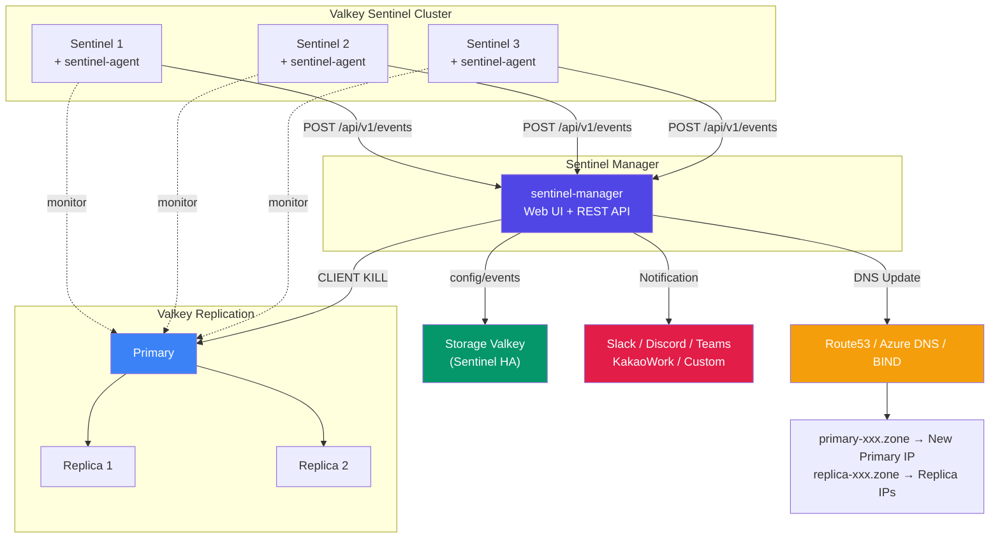
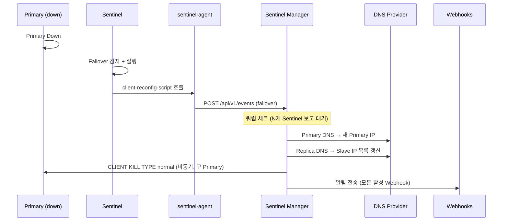
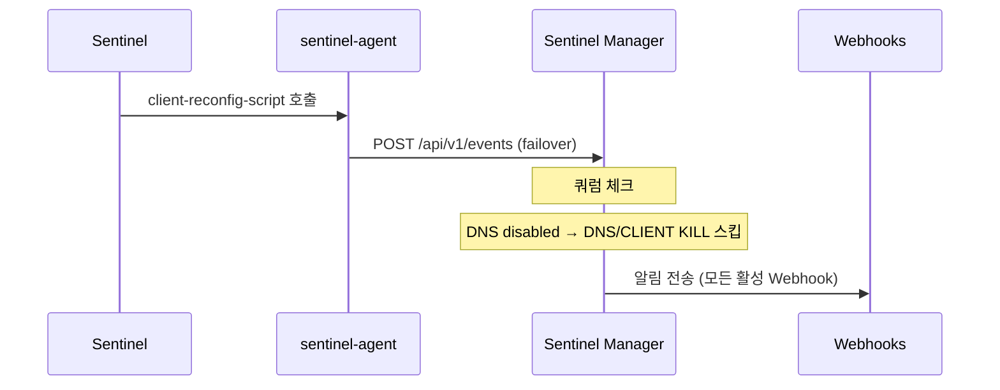

# Valkey Sentinel Manager

**Valkey Sentinel DNS Failover Automation System**

Valkey Sentinel 환경에서 primary/replica 장애 발생 시 DNS 레코드를 자동 갱신하고, 웹 UI로 Sentinel 클러스터를 통합 관리하는 시스템.

> A web-based management system for Valkey Sentinel that automatically updates DNS records on failover and provides a unified admin UI for monitoring and managing Sentinel clusters.

**Go 단일 바이너리** — HTML/CSS/JS/폰트 모두 내장. 별도 파일 배포 불필요.
Sentinel 모드 전용. Cluster 모드는 지원하지 않음.

---

## Architecture / 시스템 구성도



## Components / 구성 요소

| Component | Description | Deploy |
|-----------|-------------|--------|
| **sentinel-manager** | Web UI + REST API. 이벤트 수신, DNS 업데이트, 알림, 관리 | 별도 서버 (1대 이상) |
| **sentinel-agent** | Sentinel 스크립트 CLI. 페일오버/장애 감지 시 Manager로 이벤트 전송 | 각 Sentinel 노드 |
| **Storage Valkey** | Manager 설정, 이벤트, 분산 락 저장소 | Sentinel HA 권장 |

## Features / 주요 기능

- **DNS 기반 엔드포인트** — `primary-{name}.zone`, `replica-{name}.zone` 자동 생성/갱신
- **멀티 클라우드 DNS** — AWS Route53, Azure DNS, BIND 지원
- **DNS 없이 사용 가능** — Sentinel 모니터링 + 알림만 사용
- **자동 페일오버 처리** — Sentinel 감지 → 쿼럼 판단 → DNS 갱신 → CLIENT KILL → 알림
- **CLIENT KILL** — 페일오버 후 구 primary의 기존 클라이언트 커넥션 강제 종료
- **다중 Webhook 알림** — Slack, Discord, Teams, 카카오워크, Custom HTTP
- **Sentinel 헬스체크** — 백그라운드 모니터링, 노드 다운/복구 자동 감지 + 알림
- **Load Sentinels** — Sentinel에서 모니터링 중인 마스터 일괄 등록
- **ACL 인증** — Valkey 7+ ACL (username + password) 지원
- **분산 락 + 쿼럼** — 다중 Manager 인스턴스 안전하게 운영
- **암호화 저장** — AES-256-GCM으로 민감 데이터 암호화
- **다국어** — 영어 / 한국어
- **단일 바이너리** — embed.FS로 모든 정적 파일 내장

## Failover Workflow / 페일오버 동작 흐름

### DNS 사용 시



### DNS 미사용 시



## Event Types / 이벤트 유형

| Event | Trigger | DNS Action | Notification |
|-------|---------|------------|-------------|
| **Primary Failover** | Primary 다운 → Sentinel 페일오버 | Primary DNS → 새 IP, Replica DNS 갱신 | Yes |
| **Replica Down** | Replica 노드 다운 | Replica DNS에서 해당 IP 제거 | Yes |
| **Replica Up** | Replica 노드 복구 | Replica DNS에 해당 IP 추가 | Yes |
| **Sentinel Down** | Sentinel 노드 핑 실패 | — | Yes (알림 활성 시) |
| **Sentinel Up** | Sentinel 노드 핑 복구 | — | Yes (알림 활성 시) |

## Quick Start / 빠른 시작

### Build / 빌드

```bash
git clone https://github.com/chals-go/valkey-sentinel-manager.git
cd valkey-sentinel-manager
make build
# → bin/sentinel-manager, bin/sentinel-agent
```

### Install / 설치

```bash
# Manager 설치
sudo bash deploy/install.sh sentinel-manager

# Agent 설치 (각 Sentinel 노드)
sudo bash deploy/install.sh sentinel-agent

# 둘 다 설치
sudo bash deploy/install.sh all
```

### Configure / 설정

**Manager** (`/etc/sentinel-manager/config.yaml`):
```yaml
host: "0.0.0.0"
port: 8000
store_type: "valkey"
store_sentinels: "10.0.0.1:26379,10.0.0.2:26379,10.0.0.3:26379"
store_sentinel_master: "smgr-store"
```

**Agent** (`/etc/valkey/sentinel-agent.yaml`):
```yaml
monitor_url: "http://sentinel-manager:8000"
api_key: "smgr_xxxx"
sentinel_node_name: "sentinel-01"
group_name: "my-cluster"
```

**Sentinel** (`sentinel.conf`):
```conf
sentinel client-reconfig-script mymaster /usr/local/bin/sentinel-agent-reconfig
sentinel notification-script mymaster /usr/local/bin/sentinel-agent-notify
```

### Start / 시작

```bash
sudo systemctl start sentinel-manager
# → http://<server>:8000/admin/ (admin / admin)
```

## Supported Platforms / 지원 환경

| Category | Supported |
|----------|-----------|
| **DNS Providers** | AWS Route53, Azure DNS, BIND REST API |
| **Webhooks** | Slack, Discord, Microsoft Teams, Kakao Work, Custom HTTP |
| **Authentication** | requirepass, Valkey 7+ ACL (username + password) |
| **Store** | Valkey (Sentinel HA), Memory (dev only) |
| **OS** | Linux (Debian/Ubuntu, RHEL/CentOS, Amazon Linux) |
| **Language** | English, Korean |

## API

Bearer 토큰 인증. 웹 UI → Settings → API Token에서 발급.

```bash
# Health check (no auth)
GET /api/v1/health

# Clusters
GET    /api/v1/clusters
POST   /api/v1/clusters
GET    /api/v1/clusters/{name}
DELETE /api/v1/clusters/{name}

# Sentinels
GET    /api/v1/sentinels
POST   /api/v1/sentinels
GET    /api/v1/sentinels/{name}
DELETE /api/v1/sentinels/{name}

# Events
GET    /api/v1/events
POST   /api/v1/events
```

## Tech Stack / 기술 스택

| Area | Technology |
|------|-----------|
| Language | Go 1.24+ |
| Web Server | `net/http` (stdlib, Go 1.22+ routing) |
| Template | `html/template` + `embed.FS` |
| Valkey Client | `valkey-io/valkey-go` |
| DNS | `aws-sdk-go-v2`, `azure-sdk-for-go`, BIND REST API |
| Security | AES-256-GCM, CSRF, Bearer token, brute-force defense |
| UI | Tailwind CSS, Plus Jakarta Sans (local woff2) |

## Project Structure / 프로젝트 구조

```
valkey-sentinel-manager/
├── cmd/
│   ├── sentinel-manager/     # Manager 엔트리포인트
│   └── sentinel-agent/       # Agent 엔트리포인트
├── internal/
│   ├── api/                  # REST API 핸들러
│   ├── config/               # YAML 설정 로드
│   ├── core/                 # 이벤트 처리, 페일오버, 헬스체크, 알림, CLIENT KILL
│   ├── dns/                  # DNS 프로바이더 (Route53, Azure, BIND)
│   ├── models/               # 데이터 모델 (Cluster, Event, Sentinel, Webhook)
│   ├── server/               # HTTP 서버, 미들웨어, 라우터, 템플릿
│   ├── store/                # 저장소 인터페이스 + 구현체 (Memory, Valkey)
│   ├── agent/                # Agent CLI 로직
│   └── web/                  # 웹 UI 핸들러, 세션, i18n, CSRF, 암호화
├── web/
│   ├── templates/            # Go html/template (15+ pages)
│   └── static/               # CSS, JS, fonts (embedded)
├── deploy/
│   └── install.sh            # 통합 설치 스크립트
├── config.yaml.example       # Manager 설정 예제
├── sentinel-agent.yaml.example # Agent 설정 예제
├── Makefile
├── Dockerfile
└── Dockerfile.agent
```

## Development / 개발

```bash
make build          # Build both binaries
make build-manager  # Build manager only
make build-agent    # Build agent only
make test           # Run tests with race detector
make vet            # Static analysis
make lint           # golangci-lint
make run            # Dev run (memory store)
make docker-build   # Docker image
```

## License

Private repository
