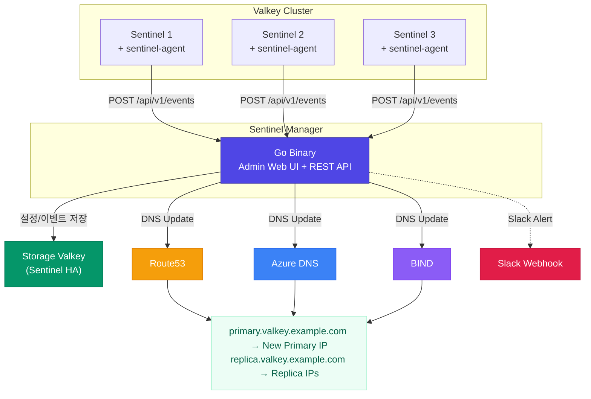

# Valkey Sentinel Manager

Valkey Sentinel DNS 페일오버 자동화 시스템.

Valkey **Sentinel 모드** 환경에서 primary/replica 장애 발생 시 DNS 레코드를 자동으로 갱신하여
클라이언트가 새로운 primary/replica에 끊김 없이 접속할 수 있도록 한다.

> **Go 단일 바이너리** — HTML/CSS/JS/폰트 모두 내장. 별도 파일 배포 불필요.
> Cluster 모드는 지원하지 않는다. Sentinel 모드 전용.

## 프로젝트 배경 — AWS ElastiCache 벤치마킹

AWS ElastiCache는 Replication Group에 **Primary Endpoint**와 **Reader Endpoint**를 자동 제공한다.
이 프로젝트는 **Valkey Sentinel**의 페일오버 기능을 활용하여 ElastiCache와 유사한 **도메인 기반 Replication Group 엔드포인트**를 오픈소스로 구현한다.

| ElastiCache | Sentinel Manager |
|-------------|------------------|
| Primary Endpoint | `primary-{name}.{zone}` DNS A 레코드 |
| Reader Endpoint | `replica-{name}.{zone}` DNS A 레코드 |
| 자동 페일오버 | Sentinel 감지 → 쿼럼 판단 → DNS 자동 갱신 |
| AWS 전용 | **멀티 클라우드** (Route53, Azure DNS, BIND) |
| 관리형 서비스 | 오픈소스, 자체 운영, **Go 단일 바이너리** |

## 시스템 구성도



## 구성 요소

| 구성 요소 | 설명 | 배포 위치 |
|-----------|------|----------|
| **sentinel-manager** | Go 바이너리. 이벤트 수신, DNS 업데이트, 관리 웹 UI, REST API, Slack 알림 | 별도 서버 (1대 이상) |
| **sentinel-agent** | Go 바이너리. Sentinel이 페일오버/replica 장애 감지 시 Manager로 이벤트 전송 | 각 Sentinel 노드 |
| **Storage Valkey** | Manager의 설정/이벤트/분산 락 데이터를 저장하는 공유 저장소 | Sentinel HA 구성 권장 |

## 기술 스택

| 영역 | 기술 |
|------|------|
| **언어** | Go 1.24+ |
| **웹 서버** | `net/http` 표준 라이브러리 (Go 1.22+ 라우팅 패턴) |
| **템플릿** | `html/template` 표준 라이브러리 |
| **정적 파일** | `embed.FS` — HTML/CSS/JS/폰트 바이너리 내장 |
| **Valkey 클라이언트** | `valkey-io/valkey-go` |
| **DNS** | AWS Route53 (`aws-sdk-go-v2`), Azure DNS (`azure-sdk-for-go`), BIND (REST API) |
| **보안** | AES-256-GCM 암호화, Bearer 토큰 인증, 브루트포스 방어 |
| **다국어** | 영어(기본) / 한국어 |
| **알림** | Slack Incoming Webhook |
| **UI 디자인** | Tailwind CSS, Meraki UI 스타일 (다크 사이드바 + 밝은 메인) |
| **폰트** | Plus Jakarta Sans (로컬 woff2 내장, CDN 의존성 0) |

## 주요 기능

- **DNS 기반 Replication Group 엔드포인트** — ElastiCache 스타일 도메인 접속
- **자동 페일오버 DNS 갱신** — Sentinel 감지 → 쿼럼 판단 → DNS A 레코드 업데이트
- **멀티 클라우드 DNS** — Route53, Azure DNS, BIND 지원 (빌드에 모두 포함, 설정으로 선택)
- **관리자 웹 UI** — Meraki UI 스타일, 다국어(영어/한국어), 자동 새로고침
- **Sentinel 실시간 모니터링** — 백그라운드 헬스체커가 모든 노드 상태를 주기적으로 확인
- **일시정지/재개** — 점검/배포 시 불필요한 failover 방지
- **DNS 동기화** — Sentinel 실시간 상태 기준으로 DNS 레코드 강제 재설정
- **복사 기능** — Replication Group 정보를 테이블 형태로 클립보드 복사
- **이벤트 검색** — 타입별 필터 (Failover, Replica Down/Up, Sentinel Down/Up) + 텍스트 검색
- **다중 API 토큰** — 여러 개 토큰 생성/개별 삭제
- **보안** — AES-256-GCM, 브루트포스 방어(5회 실패 시 5분 잠금), CSP/보안 헤더
- **Slack 알림** — Failover, Replica Down/Up, Sentinel Down/Up 이벤트 자동 알림
- **분산 환경** — 분산 락 + 쿼럼으로 다중 Manager 인스턴스 지원

## 빠른 시작

### 1. 빌드

```bash
git clone https://github.com/chals-go/valkey-sentinel-manager.git
cd valkey-sentinel-manager
make build
# → bin/sentinel-manager  (~27MB, 웹 UI + DNS 프로바이더 3종 내장)
# → bin/sentinel-agent    (~6MB, 표준 라이브러리만)
```

### 2. Manager 서버 설치

```bash
cp bin/sentinel-manager /usr/local/bin/
cp config.yaml.example /etc/sentinel-manager/config.yaml
vi /etc/sentinel-manager/config.yaml   # 저장소 Valkey 연결 정보 수정
```

```bash
# 실행
sentinel-manager --config /etc/sentinel-manager/config.yaml
# → http://localhost:8000/admin/
```

### 3. Sentinel Agent 설치

각 Sentinel 노드에 배포:

```bash
cp bin/sentinel-agent /usr/local/bin/
ln -sf /usr/local/bin/sentinel-agent /usr/local/bin/sentinel-agent-reconfig
ln -sf /usr/local/bin/sentinel-agent /usr/local/bin/sentinel-agent-notify
```

설정 파일 (`/etc/valkey/sentinel-agent.yaml`):

```yaml
monitor_url: "http://sentinel-manager:8000"
api_key: ""                      # API Token 페이지에서 발급
sentinel_node_name: "sentinel-01"
group_name: "sentinel-prod"
```

### 4. sentinel.conf 등록

```conf
sentinel client-reconfig-script mymaster /usr/local/bin/sentinel-agent-reconfig
sentinel notification-script mymaster /usr/local/bin/sentinel-agent-notify
```

## 설정 (config.yaml)

```yaml
host: "0.0.0.0"
port: 8000
debug: false

# Storage Valkey (Sentinel 경유, 프로덕션)
store_type: "valkey"
store_sentinels: "10.0.0.1:26379,10.0.0.2:26379,10.0.0.3:26379"
store_sentinel_master: "smgr-store"
store_db: 0
store_password: ""

# Direct connection (dev/test only)
# store_url: "valkey://localhost:6379/0"

event_dedup_window_seconds: 30
quorum_threshold: 2
log_dir: "/var/log/sentinel-manager"
dns_default_ttl: 3

# Auto-generated on first run
encryption_key: ""
```

환경변수(`SMGR_` 접두사)로 오버라이드 가능. 상세: `sentinel-manager --help`

## 관리자 웹 UI

`http://<서버>:8000/admin/` — 초기 계정: `admin` / `admin`

| 페이지 | 설명 |
|--------|------|
| **Dashboard** | Replication Group 현황, 최근 이벤트, Sentinel 수, 저장소 상태 |
| **Replication Group** | 등록/수정/삭제, DNS ↔ Sentinel IP 비교, 페일오버 실행, 일시정지/재개 |
| **Sentinel Cluster** | 노드 그룹 등록/수정/삭제, 실시간 연결 상태, 알림 ON/OFF |
| **Event Log** | 이벤트 이력, 타입별 필터, 텍스트 검색, 페이지네이션 |
| **Server Settings** | 런타임 설정, Sentinel Ping 주기, 언어 선택(영어/한국어) |
| **DNS Provider** | Route53/Azure DNS/BIND 등록/수정/삭제 |
| **API Token** | 다중 토큰 생성/삭제 |
| **Notification** | Slack Webhook 설정, 테스트 전송 |
| **Account** | 비밀번호 변경 |

## API

Bearer 토큰 인증. 토큰은 웹 UI의 API Token 페이지에서 발급.

```bash
# 헬스체크 (인증 불필요)
curl http://localhost:8000/api/v1/health

# 클러스터 목록
curl -H "Authorization: Bearer smgr_xxxx" http://localhost:8000/api/v1/clusters

# 이벤트 수신 (sentinel-agent가 호출)
curl -X POST -H "Authorization: Bearer smgr_xxxx" \
  -H "Content-Type: application/json" \
  -d '{"group_name":"g1","master_name":"m1","event_type":"failover",...}' \
  http://localhost:8000/api/v1/events
```

## 개발

```bash
# 빌드
make build

# 테스트
make test

# 정적 분석
make vet

# Tailwind CSS 재빌드 (템플릿 수정 후)
npx tailwindcss -i web/static/css/input.css -o web/static/css/tailwind.min.css --minify

# 개발 실행 (인메모리 저장소)
make run
```

## 디렉토리 구조

```
valkey-sentinel-manager/
├── cmd/
│   ├── sentinel-manager/main.go    # Manager 엔트리포인트
│   └── sentinel-agent/main.go      # Agent 엔트리포인트
├── internal/
│   ├── config/                     # YAML 설정 로드
│   ├── server/                     # HTTP 서버, 미들웨어, 라우터
│   ├── api/                        # REST API 핸들러
│   ├── web/                        # 관리자 웹 UI 핸들러, 인증, i18n, 암호화
│   ├── core/                       # 이벤트 처리, 페일오버, Sentinel 명령, 알림, 헬스체커
│   ├── dns/                        # DNS 프로바이더 (Route53, Azure, BIND)
│   ├── store/                      # 저장소 (인터페이스, 인메모리, Valkey)
│   ├── models/                     # 데이터 모델
│   └── agent/                      # Agent 로직
├── web/
│   ├── templates/                  # Go html/template
│   └── static/                     # CSS, JS, 폰트 (embed.FS로 내장)
├── config.yaml.example
├── sentinel-agent.yaml.example
├── Makefile
├── Dockerfile
└── Dockerfile.agent
```

## 상세 문서

- [관리자 웹 UI 가이드](docs/ADMIN_UI.md) — 페이지별 사용법
- [설치 가이드](docs/INSTALL.md) — Manager + Agent 설치
- [클라우드별 권한 설정](docs/CLOUD_PERMISSIONS.md) — AWS IAM, Azure 권한

## 라이선스

Private repository
